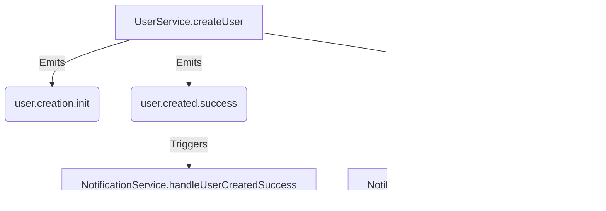

# Event Flow Graph

This document is auto-generated by the `EventDocumentationService`. Do not edit manually.

```mermaid
graph TD;

    N0_UserService_createUser["UserService.createUser"]
    N0_UserService_createUser["UserService.createUser"]
    N0_UserService_createUser["UserService.createUser"]
    N1_NotificationService_handleUserCreatedSuccess["NotificationService.handleUserCreatedSuccess"]
    N2_NotificationService_handleUserCreatedFailure["NotificationService.handleUserCreatedFailure"]
    N3_user_creation_init("user.creation.init")
    N4_user_created_success("user.created.success")
    N5_user_created_failure("user.created.failure")

    N0_UserService_createUser -- Emits --> N3_user_creation_init
    N0_UserService_createUser -- Emits --> N4_user_created_success
    N0_UserService_createUser -- Emits --> N5_user_created_failure
    N4_user_created_success -- Triggers --> N1_NotificationService_handleUserCreatedSuccess
    N5_user_created_failure -- Triggers --> N2_NotificationService_handleUserCreatedFailure
```
