# Saga Event Documentation

## Event Flow

```mermaid
graph TD;

    classDef event-successStyle fill:#d4edda,stroke:#c3e6cb,color:#155724
    classDef event-failureStyle fill:#f8d7da,stroke:#f5c6cb,color:#721c24
    classDef event-initStyle fill:#cce5ff,stroke:#b8daff,color:#004085
    classDef event-defaultStyle fill:#e2e3e5,stroke:#d6d8db,color:#383d41
    classDef emitterStyle fill:#d4edda,stroke:#c3e6cb,color:#155724
    classDef handlerStyle fill:#d1ecf1,stroke:#bee5eb,color:#0c5460
    classDef listenerStyle fill:#fff3cd,stroke:#ffeeba,color:#856404
    classDef gateStyle fill:#e2e3e5,stroke:#d6d8db,color:#383d41

    subgraph "Flujo de Eventos"
        N0_UserService.createUser["UserService.createUser"]
        N1_UserService.methodThatReturnsBuffer["UserService.methodThatReturnsBuffer"]
        N2_VideoService.processUploadedVideo["VideoService.processUploadedVideo"]
        N3_TranscodingService.handleVideoUploaded["TranscodingService.handleVideoUploaded"]
        N4_ThumbnailService.handleVideoUploaded["ThumbnailService.handleVideoUploaded"]
        N5_VerificationService.verifyVideoProcessing["VerificationService.verifyVideoProcessing"]
        N6_PublisherService.publishVideo["PublisherService.publishVideo"]
        N7_NotificationService.handleUserCreatedSuccess["NotificationService.handleUserCreatedSuccess"]
        N8_NotificationService.handleUserCreatedFailure["NotificationService.handleUserCreatedFailure"]
        N9_VideoFeedbackService.handleUploadFailure["VideoFeedbackService.handleUploadFailure"]
        N10_TranscodingFeedbackService.handleTranscodingFailure["TranscodingFeedbackService.handleTranscodingFailure"]
        N11_ThumbnailFeedbackService.handleThumbnailFailure["ThumbnailFeedbackService.handleThumbnailFailure"]
        N12_VerificationFeedbackService.handleVerificationFailure["VerificationFeedbackService.handleVerificationFailure"]
        N13_PublisherFeedbackService.handlePublishingFailure["PublisherFeedbackService.handlePublishingFailure"]
        N14_user.creation.init(["user.creation.init"])
        N15_user.created.success(["user.created.success"])
        N16_user.created.failure(["user.created.failure"])
        N17_user.buffer.success(["user.buffer.success"])
        N18_user.buffer.failure(["user.buffer.failure"])
        N19_video.uploaded(["video.uploaded"])
        N20_video.upload.failed(["video.upload.failed"])
        N21_video.transcoded.success(["video.transcoded.success"])
        N22_video.transcoded.failure(["video.transcoded.failure"])
        N23_thumbnail.generated.success(["thumbnail.generated.success"])
        N24_thumbnail.generated.failure(["thumbnail.generated.failure"])
        N25_video.ready.to.publish(["video.ready.to.publish"])
        N26_video.verification.failed(["video.verification.failed"])
        N27_video.published.success(["video.published.success"])
        N28_video.published.failure(["video.published.failure"])

        N0_UserService.createUser -- Emite --> N14_user.creation.init
        N0_UserService.createUser -- Emite --> N15_user.created.success
        N0_UserService.createUser -- Emite --> N16_user.created.failure
        N1_UserService.methodThatReturnsBuffer -- Emite --> N17_user.buffer.success
        N1_UserService.methodThatReturnsBuffer -- Emite --> N18_user.buffer.failure
        N2_VideoService.processUploadedVideo -- Emite --> N19_video.uploaded
        N2_VideoService.processUploadedVideo -- Emite --> N20_video.upload.failed
        N3_TranscodingService.handleVideoUploaded -- Emite --> N21_video.transcoded.success
        N3_TranscodingService.handleVideoUploaded -- Emite --> N22_video.transcoded.failure
        N4_ThumbnailService.handleVideoUploaded -- Emite --> N23_thumbnail.generated.success
        N4_ThumbnailService.handleVideoUploaded -- Emite --> N24_thumbnail.generated.failure
        N5_VerificationService.verifyVideoProcessing -- Emite --> N25_video.ready.to.publish
        N5_VerificationService.verifyVideoProcessing -- Emite --> N26_video.verification.failed
        N6_PublisherService.publishVideo -- Emite --> N27_video.published.success
        N6_PublisherService.publishVideo -- Emite --> N28_video.published.failure
        N15_user.created.success -. Dispara .-> N7_NotificationService.handleUserCreatedSuccess
        N16_user.created.failure -. Dispara .-> N8_NotificationService.handleUserCreatedFailure
        N20_video.upload.failed -. Dispara .-> N9_VideoFeedbackService.handleUploadFailure
        N19_video.uploaded -. Dispara .-> N3_TranscodingService.handleVideoUploaded
        N22_video.transcoded.failure -. Dispara .-> N10_TranscodingFeedbackService.handleTranscodingFailure
        N19_video.uploaded -. Dispara .-> N4_ThumbnailService.handleVideoUploaded
        N24_thumbnail.generated.failure -. Dispara .-> N11_ThumbnailFeedbackService.handleThumbnailFailure
        N21_video.transcoded.success -. Dispara .-> N5_VerificationService.verifyVideoProcessing
        N23_thumbnail.generated.success -. Dispara .-> N5_VerificationService.verifyVideoProcessing
        N26_video.verification.failed -. Dispara .-> N12_VerificationFeedbackService.handleVerificationFailure
        N25_video.ready.to.publish -. Dispara .-> N6_PublisherService.publishVideo
        N28_video.published.failure -. Dispara .-> N13_PublisherFeedbackService.handlePublishingFailure
    end

    subgraph Leyenda
        direction LR
        N29_Emisor__Inicia_un_proceso_de_negocio_o__Saga__["Emisor (Inicia un proceso de negocio o 'Saga')"]
        N30_Manejador__Recibe_un_evento_y_emite_otros_para_continuar_el_flujo_["Manejador (Recibe un evento y emite otros para continuar el flujo)"]
        N31_Receptor__Recibe_un_evento_y_finaliza_una_rama_del_flujo__ej__notificar_["Receptor (Recibe un evento y finaliza una rama del flujo, ej: notificar)"]
        N32_Evento__Mensaje_que_representa_un_hecho_ocurrido_en_el_sistema_(("Evento (Mensaje que representa un hecho ocurrido en el sistema)"))
        N33_Compuerta_L_gica__Espera_varios_eventos_antes_de_continuar_["Compuerta Lógica (Espera varios eventos antes de continuar)"]
        subgraph "Relaciones"
            direction LR
            N34_A( ) -- Emite --> N35_B( )
            N36_C( ) -. Dispara .-> N37_D( )
        end
    end

    class N0_UserService.createUser,N1_UserService.methodThatReturnsBuffer,N2_VideoService.processUploadedVideo emitterStyle
    class N3_TranscodingService.handleVideoUploaded,N4_ThumbnailService.handleVideoUploaded,N5_VerificationService.verifyVideoProcessing,N6_PublisherService.publishVideo handlerStyle
    class N7_NotificationService.handleUserCreatedSuccess,N8_NotificationService.handleUserCreatedFailure,N9_VideoFeedbackService.handleUploadFailure,N10_TranscodingFeedbackService.handleTranscodingFailure,N11_ThumbnailFeedbackService.handleThumbnailFailure,N12_VerificationFeedbackService.handleVerificationFailure,N13_PublisherFeedbackService.handlePublishingFailure listenerStyle
    class N14_user.creation.init event-initStyle
    class N15_user.created.success,N17_user.buffer.success,N19_video.uploaded,N21_video.transcoded.success,N23_thumbnail.generated.success,N25_video.ready.to.publish,N27_video.published.success event-successStyle
    class N16_user.created.failure,N18_user.buffer.failure,N20_video.upload.failed,N22_video.transcoded.failure,N24_thumbnail.generated.failure,N26_video.verification.failed,N28_video.published.failure event-failureStyle
    class N29_Emisor__Inicia_un_proceso_de_negocio_o__Saga__ emitterStyle
    class N30_Manejador__Recibe_un_evento_y_emite_otros_para_continuar_el_flujo_ handlerStyle
    class N31_Receptor__Recibe_un_evento_y_finaliza_una_rama_del_flujo__ej__notificar_ listenerStyle
    class N33_Compuerta_L_gica__Espera_varios_eventos_antes_de_continuar_ gateStyle
```

## Event Catalog

### `user.creation.init`

**Description**: No description provided.

**Emitted By**:
- `UserService.createUser`

---
### `user.created.success`

**Description**: No description provided.

**Emitted By**:
- `UserService.createUser`

**Listened By**:
- `NotificationService.handleUserCreatedSuccess`

---
### `user.created.failure`

**Description**: No description provided.

**Emitted By**:
- `UserService.createUser`

**Listened By**:
- `NotificationService.handleUserCreatedFailure`

---
### `user.buffer.success`

**Description**: No description provided.

**Emitted By**:
- `UserService.methodThatReturnsBuffer`

---
### `user.buffer.failure`

**Description**: No description provided.

**Emitted By**:
- `UserService.methodThatReturnsBuffer`

---
### `video.uploaded`

**Description**: Fired when a video is uploaded and ready for processing.

**Emitted By**:
- `VideoService.processUploadedVideo`

**Listened By**:
- `TranscodingService.handleVideoUploaded`
- `ThumbnailService.handleVideoUploaded`

---
### `video.upload.failed`

**Description**: Fired if the initial video upload processing fails.

**Emitted By**:
- `VideoService.processUploadedVideo`

**Listened By**:
- `VideoFeedbackService.handleUploadFailure`

---
### `video.transcoded.success`

**Description**: Fired when video transcoding is complete.

**Emitted By**:
- `TranscodingService.handleVideoUploaded`

**Listened By**:
- `VerificationService.verifyVideoProcessing`

---
### `video.transcoded.failure`

**Description**: Fired if video transcoding fails.

**Emitted By**:
- `TranscodingService.handleVideoUploaded`

**Listened By**:
- `TranscodingFeedbackService.handleTranscodingFailure`

---
### `thumbnail.generated.success`

**Description**: Fired when a video thumbnail is generated.

**Emitted By**:
- `ThumbnailService.handleVideoUploaded`

**Listened By**:
- `VerificationService.verifyVideoProcessing`

---
### `thumbnail.generated.failure`

**Description**: Fired if thumbnail generation fails.

**Emitted By**:
- `ThumbnailService.handleVideoUploaded`

**Listened By**:
- `ThumbnailFeedbackService.handleThumbnailFailure`

---
### `video.ready.to.publish`

**Description**: Fired when all video processing steps are confirmed to be complete.

**Emitted By**:
- `VerificationService.verifyVideoProcessing`

**Listened By**:
- `PublisherService.publishVideo`

---
### `video.verification.failed`

**Description**: Fired if the verification process fails.

**Emitted By**:
- `VerificationService.verifyVideoProcessing`

**Listened By**:
- `VerificationFeedbackService.handleVerificationFailure`

---
### `video.published.success`

**Description**: Fired when the video is fully processed and published.

**Emitted By**:
- `PublisherService.publishVideo`

---
### `video.published.failure`

**Description**: Fired if the final publishing step fails.

**Emitted By**:
- `PublisherService.publishVideo`

**Listened By**:
- `PublisherFeedbackService.handlePublishingFailure`

---
