# Saga Event Documentation

## Event Flow

```mermaid
graph TD;

    classDef emitterStyle fill:#d4edda,stroke:#c3e6cb,color:#155724
    classDef handlerStyle fill:#d1ecf1,stroke:#bee5eb,color:#0c5460
    classDef listenerStyle fill:#fff3cd,stroke:#ffeeba,color:#856404
    classDef eventStyle fill:#f8d7da,stroke:#f5c6cb,color:#721c24,stroke-width:2px,font-weight:bold
    classDef gateStyle fill:#e2e3e5,stroke:#d6d8db,color:#383d41

    subgraph "Flujo de Eventos"
        N0_UserService.createUser["UserService.createUser"]
        N1_OrderService.placeOrder["OrderService.placeOrder"]
        N2_InventoryService.handleOrderPlacement["InventoryService.handleOrderPlacement"]
        N3_PaymentService.handleInventoryReserved["PaymentService.handleInventoryReserved"]
        N4_VideoService.processUploadedVideo["VideoService.processUploadedVideo"]
        N5_TranscodingService.handleVideoUploaded["TranscodingService.handleVideoUploaded"]
        N6_ThumbnailService.handleVideoUploaded["ThumbnailService.handleVideoUploaded"]
        N7_PublishingService.publishVideo["PublishingService.publishVideo"]
        N8_NotificationService.handleUserCreatedSuccess["NotificationService.handleUserCreatedSuccess"]
        N9_NotificationService.handleUserCreatedFailure["NotificationService.handleUserCreatedFailure"]
        N10_NotificationService.handleOrderConfirmed["NotificationService.handleOrderConfirmed"]
        N11_NotificationService.handleInventoryFailure["NotificationService.handleInventoryFailure"]
        N12_NotificationService.handlePaymentFailure["NotificationService.handlePaymentFailure"]
        N13_InventoryService.handlePaymentFailure["InventoryService.handlePaymentFailure"]
        N14_PublishingService.handleTranscodingSuccess["PublishingService.handleTranscodingSuccess"]
        N15_PublishingService.handleThumbnailSuccess["PublishingService.handleThumbnailSuccess"]
        N16_user.creation.init(["user.creation.init"])
        N17_user.created.success(["user.created.success"])
        N18_user.created.failure(["user.created.failure"])
        N19_order.placement.init(["order.placement.init"])
        N20_order.confirmed.success(["order.confirmed.success"])
        N21_order.placement.failed(["order.placement.failed"])
        N22_inventory.reserved.success(["inventory.reserved.success"])
        N23_inventory.reserved.failure(["inventory.reserved.failure"])
        N24_payment.processed.success(["payment.processed.success"])
        N25_payment.processed.failure(["payment.processed.failure"])
        N26_video.uploaded(["video.uploaded"])
        N27_video.upload.failed(["video.upload.failed"])
        N28_video.transcoded.success(["video.transcoded.success"])
        N29_video.transcoded.failure(["video.transcoded.failure"])
        N30_thumbnail.generated.success(["thumbnail.generated.success"])
        N31_thumbnail.generated.failure(["thumbnail.generated.failure"])
        N32_video.published.success(["video.published.success"])
        N33_video.published.failure(["video.published.failure"])
        N34_All_Video_Tasks_Complete["All Video Tasks Complete"]

        N0_UserService.createUser -- Emite --> N16_user.creation.init
        N0_UserService.createUser -- Emite --> N17_user.created.success
        N0_UserService.createUser -- Emite --> N18_user.created.failure
        N1_OrderService.placeOrder -- Emite --> N19_order.placement.init
        N1_OrderService.placeOrder -- Emite --> N20_order.confirmed.success
        N1_OrderService.placeOrder -- Emite --> N21_order.placement.failed
        N2_InventoryService.handleOrderPlacement -- Emite --> N22_inventory.reserved.success
        N2_InventoryService.handleOrderPlacement -- Emite --> N23_inventory.reserved.failure
        N3_PaymentService.handleInventoryReserved -- Emite --> N24_payment.processed.success
        N3_PaymentService.handleInventoryReserved -- Emite --> N25_payment.processed.failure
        N4_VideoService.processUploadedVideo -- Emite --> N26_video.uploaded
        N4_VideoService.processUploadedVideo -- Emite --> N27_video.upload.failed
        N5_TranscodingService.handleVideoUploaded -- Emite --> N28_video.transcoded.success
        N5_TranscodingService.handleVideoUploaded -- Emite --> N29_video.transcoded.failure
        N6_ThumbnailService.handleVideoUploaded -- Emite --> N30_thumbnail.generated.success
        N6_ThumbnailService.handleVideoUploaded -- Emite --> N31_thumbnail.generated.failure
        N7_PublishingService.publishVideo -- Emite --> N32_video.published.success
        N7_PublishingService.publishVideo -- Emite --> N33_video.published.failure
        N17_user.created.success -. Dispara .-> N8_NotificationService.handleUserCreatedSuccess
        N18_user.created.failure -. Dispara .-> N9_NotificationService.handleUserCreatedFailure
        N20_order.confirmed.success -. Dispara .-> N10_NotificationService.handleOrderConfirmed
        N23_inventory.reserved.failure -. Dispara .-> N11_NotificationService.handleInventoryFailure
        N25_payment.processed.failure -. Dispara .-> N12_NotificationService.handlePaymentFailure
        N19_order.placement.init -. Dispara .-> N2_InventoryService.handleOrderPlacement
        N25_payment.processed.failure -. Dispara .-> N13_InventoryService.handlePaymentFailure
        N22_inventory.reserved.success -. Dispara .-> N3_PaymentService.handleInventoryReserved
        N26_video.uploaded -. Dispara .-> N5_TranscodingService.handleVideoUploaded
        N26_video.uploaded -. Dispara .-> N6_ThumbnailService.handleVideoUploaded
        N28_video.transcoded.success -. Dispara .-> N14_PublishingService.handleTranscodingSuccess
        N30_thumbnail.generated.success -. Dispara .-> N15_PublishingService.handleThumbnailSuccess
        N28_video.transcoded.success -. Dispara .-> N34_All_Video_Tasks_Complete
        N30_thumbnail.generated.success -. Dispara .-> N34_All_Video_Tasks_Complete
        N34_All_Video_Tasks_Complete -. Dispara .-> N7_PublishingService.publishVideo
    end

    subgraph Leyenda
        direction LR
        N35_Emisor__Inicia_un_proceso_de_negocio_o__Saga__["Emisor (Inicia un proceso de negocio o 'Saga')"]
        N36_Manejador__Recibe_un_evento_y_emite_otros_para_continuar_el_flujo_["Manejador (Recibe un evento y emite otros para continuar el flujo)"]
        N37_Receptor__Recibe_un_evento_y_finaliza_una_rama_del_flujo__ej__notificar_["Receptor (Recibe un evento y finaliza una rama del flujo, ej: notificar)"]
        N38_Evento__Mensaje_que_representa_un_hecho_ocurrido_en_el_sistema_(("Evento (Mensaje que representa un hecho ocurrido en el sistema)"))
        N39_Compuerta_L_gica__Espera_varios_eventos_antes_de_continuar_["Compuerta Lógica (Espera varios eventos antes de continuar)"]
        subgraph "Relaciones"
            direction LR
            N40_A( ) -- Emite --> N41_B( )
            N42_C( ) -. Dispara .-> N43_D( )
        end
    end

    class N0_UserService.createUser,N1_OrderService.placeOrder,N4_VideoService.processUploadedVideo,N7_PublishingService.publishVideo emitterStyle
    class N2_InventoryService.handleOrderPlacement,N3_PaymentService.handleInventoryReserved,N5_TranscodingService.handleVideoUploaded,N6_ThumbnailService.handleVideoUploaded handlerStyle
    class N8_NotificationService.handleUserCreatedSuccess,N9_NotificationService.handleUserCreatedFailure,N10_NotificationService.handleOrderConfirmed,N11_NotificationService.handleInventoryFailure,N12_NotificationService.handlePaymentFailure,N13_InventoryService.handlePaymentFailure,N14_PublishingService.handleTranscodingSuccess,N15_PublishingService.handleThumbnailSuccess listenerStyle
    class N16_user.creation.init,N17_user.created.success,N18_user.created.failure,N19_order.placement.init,N20_order.confirmed.success,N21_order.placement.failed,N22_inventory.reserved.success,N23_inventory.reserved.failure,N24_payment.processed.success,N25_payment.processed.failure,N26_video.uploaded,N27_video.upload.failed,N28_video.transcoded.success,N29_video.transcoded.failure,N30_thumbnail.generated.success,N31_thumbnail.generated.failure,N32_video.published.success,N33_video.published.failure eventStyle
    class N34_All_Video_Tasks_Complete gateStyle
    class N35_Emisor__Inicia_un_proceso_de_negocio_o__Saga__ emitterStyle
    class N36_Manejador__Recibe_un_evento_y_emite_otros_para_continuar_el_flujo_ handlerStyle
    class N37_Receptor__Recibe_un_evento_y_finaliza_una_rama_del_flujo__ej__notificar_ listenerStyle
    class N38_Evento__Mensaje_que_representa_un_hecho_ocurrido_en_el_sistema_ eventStyle
    class N39_Compuerta_L_gica__Espera_varios_eventos_antes_de_continuar_ gateStyle
    click N16_user.creation.init "#usercreationinit" "Go to user.creation.init details"
    click N17_user.created.success "#usercreatedsuccess" "Go to user.created.success details"
    click N18_user.created.failure "#usercreatedfailure" "Go to user.created.failure details"
    click N19_order.placement.init "#orderplacementinit" "Go to order.placement.init details"
    click N20_order.confirmed.success "#orderconfirmedsuccess" "Go to order.confirmed.success details"
    click N21_order.placement.failed "#orderplacementfailed" "Go to order.placement.failed details"
    click N22_inventory.reserved.success "#inventoryreservedsuccess" "Go to inventory.reserved.success details"
    click N23_inventory.reserved.failure "#inventoryreservedfailure" "Go to inventory.reserved.failure details"
    click N24_payment.processed.success "#paymentprocessedsuccess" "Go to payment.processed.success details"
    click N25_payment.processed.failure "#paymentprocessedfailure" "Go to payment.processed.failure details"
    click N26_video.uploaded "#videouploaded" "Go to video.uploaded details"
    click N27_video.upload.failed "#videouploadfailed" "Go to video.upload.failed details"
    click N28_video.transcoded.success "#videotranscodedsuccess" "Go to video.transcoded.success details"
    click N29_video.transcoded.failure "#videotranscodedfailure" "Go to video.transcoded.failure details"
    click N30_thumbnail.generated.success "#thumbnailgeneratedsuccess" "Go to thumbnail.generated.success details"
    click N31_thumbnail.generated.failure "#thumbnailgeneratedfailure" "Go to thumbnail.generated.failure details"
    click N32_video.published.success "#videopublishedsuccess" "Go to video.published.success details"
    click N33_video.published.failure "#videopublishedfailure" "Go to video.published.failure details"
```

## Event Catalog

### `user.creation.init`

**Description**: No description provided.

**Emitted By**:
- `UserService.createUser`

---
### `user.created.success`

**Description**: No description provided.

**Emitted By**:
- `UserService.createUser`

**Listened By**:
- `NotificationService.handleUserCreatedSuccess`

---
### `user.created.failure`

**Description**: No description provided.

**Emitted By**:
- `UserService.createUser`

**Listened By**:
- `NotificationService.handleUserCreatedFailure`

---
### `order.placement.init`

**Description**: Starts the order placement process.

**Emitted By**:
- `OrderService.placeOrder`

**Listened By**:
- `InventoryService.handleOrderPlacement`

---
### `order.confirmed.success`

**Description**: Fired when the order is fully confirmed and paid.

**Emitted By**:
- `OrderService.placeOrder`

**Listened By**:
- `NotificationService.handleOrderConfirmed`

---
### `order.placement.failed`

**Description**: Fired when any step in the order placement saga fails.

**Emitted By**:
- `OrderService.placeOrder`

---
### `inventory.reserved.success`

**Description**: Fired when stock has been successfully reserved.

**Emitted By**:
- `InventoryService.handleOrderPlacement`

**Listened By**:
- `PaymentService.handleInventoryReserved`

---
### `inventory.reserved.failure`

**Description**: Fired when there is not enough stock.

**Emitted By**:
- `InventoryService.handleOrderPlacement`

**Listened By**:
- `NotificationService.handleInventoryFailure`

---
### `payment.processed.success`

**Description**: Fired when the payment is successfully processed.

**Emitted By**:
- `PaymentService.handleInventoryReserved`

---
### `payment.processed.failure`

**Description**: Fired when the payment is rejected.

**Emitted By**:
- `PaymentService.handleInventoryReserved`

**Listened By**:
- `NotificationService.handlePaymentFailure`
- `InventoryService.handlePaymentFailure`

---
### `video.uploaded`

**Description**: Fired when a video is uploaded and ready for processing.

**Emitted By**:
- `VideoService.processUploadedVideo`

**Listened By**:
- `TranscodingService.handleVideoUploaded`
- `ThumbnailService.handleVideoUploaded`

---
### `video.upload.failed`

**Description**: Fired if the initial video upload processing fails.

**Emitted By**:
- `VideoService.processUploadedVideo`

---
### `video.transcoded.success`

**Description**: Fired when video transcoding is complete.

**Emitted By**:
- `TranscodingService.handleVideoUploaded`

**Listened By**:
- `PublishingService.handleTranscodingSuccess`

---
### `video.transcoded.failure`

**Description**: Fired if video transcoding fails.

**Emitted By**:
- `TranscodingService.handleVideoUploaded`

---
### `thumbnail.generated.success`

**Description**: Fired when a video thumbnail is generated.

**Emitted By**:
- `ThumbnailService.handleVideoUploaded`

**Listened By**:
- `PublishingService.handleThumbnailSuccess`

---
### `thumbnail.generated.failure`

**Description**: Fired if thumbnail generation fails.

**Emitted By**:
- `ThumbnailService.handleVideoUploaded`

---
### `video.published.success`

**Description**: Fired when the video is fully processed and published.

**Emitted By**:
- `PublishingService.publishVideo`

---
### `video.published.failure`

**Description**: Fired if the final publishing step fails.

**Emitted By**:
- `PublishingService.publishVideo`

---
