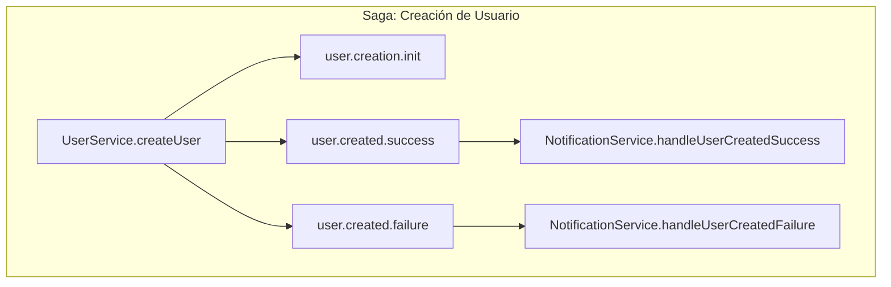

# Primeros Pasos con SagaEventModule

Esta guía te guiará a través del proceso de uso del `SagaEventModule` para construir sagas coreografiadas y basadas en eventos en tu aplicación NestJS. Cubriremos un caso de uso simple y uno más complejo, ambos basados en los ejemplos que se encuentran en el directorio `src/sample`.

## Conceptos Clave

El `SagaEventModule` está diseñado para simplificar los flujos de trabajo asíncronos automatizando tareas comunes como la emisión de eventos, el manejo de errores y la trazabilidad. Los componentes clave con los que interactuarás son:

- **`@EmitsEvent(options)`**: Un decorador de método que envuelve automáticamente tu lógica de negocio. Emite eventos de éxito o fallo basándose en si tu método devuelve un valor o lanza un error. También se encarga de emitir un evento inicial (`onInit`).
- **`@OnEventDoc(eventName)`**: Un decorador de método que suscribe un método a uno o más eventos. Es un envoltorio del `@OnEvent` nativo de NestJS pero añade metadatos para la generación automática de documentación.
- **`@CausationEvent()`**: Un decorador de parámetro utilizado dentro de un método que escucha eventos. Inyecta el payload completo del evento entrante que activó el listener, facilitando el acceso a los datos y el mantenimiento de la cadena de trazabilidad (`correlationId`, `causationId`).

## 1. Configuración

Primero, asegúrate de que el `SagaEventModule` esté importado en tu módulo raíz (por ejemplo, `AppModule`). Esto inicializará todos los servicios necesarios y comenzará los procesos automáticos de generación de documentación y tipos.

```typescript
// src/app.module.ts
import { Module } from '@nestjs/common';
import { SagaEventModule } from './saga-event-module/saga-event.module';
import { SimpleModule } from './sample/simple/simple.module';
import { VideoProcessingModule } from './sample/video-processing/video-processing.module';
import { DatabaseModule } from './database/database.module';

@Module({
  imports: [
    SagaEventModule,
    DatabaseModule.forRoot({ dbName: 'event-log.json' }),
    // --- Módulos de Ejemplo ---
    SimpleModule,
    VideoProcessingModule,
  ],
})
export class AppModule {}
```

## 2. Tutorial: Una Saga Simple (Creación de Usuario)

En este ejemplo, un `UserService` intentará crear un usuario. Tras el éxito o el fracaso, un `NotificationService` reaccionará en consecuencia enviando un correo electrónico de bienvenida o registrando una alerta para el administrador.

### Paso 1: Iniciando la Saga

La saga comienza cuando un actor externo, como una petición HTTP, llama al método `createUser` en `UserService`.

El decorador `@EmitsEvent` orquesta todo el flujo:
1.  **`onInit`**: Emite `user.creation.init` inmediatamente.
2.  **`onSuccess`**: Si `createUser` devuelve un valor, emite `user.created.success` con ese valor como payload.
3.  **`onFailure`**: Si `createUser` lanza un error, emite `user.created.failure` con el error como payload.

No necesitas escribir ningún bloque `try/catch` ni llamar al emisor de eventos manualmente.

```typescript
// src/sample/simple/user/user.service.ts
import { Injectable, Logger } from '@nestjs/common';
import { EmitsEvent } from '../../../saga-event-module/decorators/emits-event.decorator';
import { CreateUserDto } from './user.dto';

@Injectable()
export class UserService {
  private readonly logger = new Logger(UserService.name);

  @EmitsEvent({
    onInit: { name: 'user.creation.init' },
    onSuccess: { name: 'user.created.success' },
    onFailure: { name: 'user.created.failure' },
  })
  async createUser(createUserDto: CreateUserDto) {
    this.logger.log('Intentando crear usuario:', createUserDto);

    // Simula un proceso que puede fallar
    if (Math.random() < 0.5) {
      throw new Error('Fallo aleatorio durante la creación del usuario');
    }

    const user = { id: '12345', ...createUserDto };
    this.logger.log('Usuario creado en el servicio:', user);
    return user; // Este valor se convierte en el payload de 'user.created.success'
  }
}
```

### Paso 2: Reaccionando a los Eventos

El `NotificationService` escucha los eventos de resultado.

- El decorador `@OnEventDoc('user.created.success')` suscribe el método `handleUserCreatedSuccess` al evento de éxito.
- El decorador `@CausationEvent()` inyecta el `EventPayload`, que contiene los datos del usuario de `UserService` y los metadatos para el rastreo.

El mismo patrón se aplica al caso de fallo.

```typescript
// src/sample/simple/notifications/notification.service.ts
import { Injectable, Logger } from '@nestjs/common';
import { OnEventDoc } from '#/src/saga-event-module/decorators/on-event-doc.decorator';
import { EventPayload } from '#/src/saga-event-module/interfaces/event.interfaces';
import { CausationEvent } from '#/src/saga-event-module/decorators/causation-event.decorator';

@Injectable()
export class NotificationService {
  private readonly logger = new Logger(NotificationService.name);

  @OnEventDoc('user.created.success')
  handleUserCreatedSuccess(
    @CausationEvent()
    payload: EventPayload<{ id: string; name: string; email: string }>,
  ) {
    this.logger.log('--- Servicio de Notificación: Éxito ---');
    this.logger.log(
      `Enviando correo de bienvenida a ${payload.data.name} (${payload.data.email})`,
    );
    this.logger.log('ID de Correlación:', payload.metadata.correlationId);
  }

  @OnEventDoc('user.created.failure')
  handleUserCreatedFailure(@CausationEvent() payload: EventPayload<Error>) {
    this.logger.log('--- Servicio de Notificación: Fallo ---');
    this.logger.log(
      `Notificando al administrador sobre el fallo en la creación del usuario. Razón: ${payload.data.message}`,
    );
    this.logger.log('ID de Correlación:', payload.metadata.correlationId);
  }
}
```

## 3. Tutorial: Una Saga Compleja (Procesamiento de Video)

Este ejemplo demuestra una saga más avanzada con procesamiento en paralelo y un paso final de agregación.

**El Flujo:**
1.  Se sube un video (`VideoService`).
2.  La transcodificación y la generación de miniaturas ocurren en paralelo (`TranscodingService`, `ThumbnailService`).
3.  Un `VerificationService` espera a que ambos procesos se completen.
4.  Una vez verificado, el `PublisherService` publica el video.

### Paso 1: El Punto de Partida

`VideoService` inicia la saga emitiendo `video.uploaded`.

```typescript
// src/sample/video-processing/video/video.service.ts
@Injectable()
export class VideoService {
  @EmitsEvent({
    onSuccess: { name: 'video.uploaded' },
    onFailure: { name: 'video.upload.failed' },
  })
  processUploadedVideo(uploadVideoDto: UploadVideoDto) {
    // ...
    return uploadVideoDto;
  }
}
```

### Paso 2: Procesamiento en Paralelo

Tanto `TranscodingService` como `ThumbnailService` escuchan el evento `video.uploaded` y comienzan su trabajo de forma independiente.

```typescript
// src/sample/video-processing/transcoding/transcoding.service.ts
@Injectable()
export class TranscodingService {
  @OnEventDoc('video.uploaded')
  @EmitsEvent({
    onSuccess: { name: 'video.transcoded.success' },
    onFailure: { name: 'video.transcoded.failure' },
  })
  async handleVideoUploaded(@CausationEvent() payload: EventPayload<UploadVideoDto>) {
    // ... lógica de transcodificación ...
    return { ...payload.data, transcodedFormats: ['1080p', '720p'] };
  }
}

// src/sample/video-processing/thumbnail/thumbnail.service.ts
@Injectable()
export class ThumbnailService {
  @OnEventDoc('video.uploaded')
  @EmitsEvent({
    onSuccess: { name: 'thumbnail.generated.success' },
    onFailure: { name: 'thumbnail.generated.failure' },
  })
  handleVideoUploaded(@CausationEvent() payload: EventPayload<UploadVideoDto>) {
    // ... lógica de miniaturas ...
    return { ...payload.data, thumbnailPath: 'path/to/thumb.jpg' };
  }
}
```

### Paso 3: El Coordinador (Compuerta de Verificación)

El `VerificationService` es la clave para gestionar el flujo de trabajo en paralelo. Escucha los eventos de éxito de *ambos* servicios, el de transcodificación y el de miniaturas.

- Utiliza una base de datos (`JsonDatabaseService`) para almacenar el estado de la saga de procesamiento de video, identificado por el `correlationId`.
- Cuando llega un evento, actualiza el estado.
- Comprueba si ambos procesos (`hasTranscodingFinished` y `hasThumbnailFinished`) están completos.
- **Crucialmente, si el procesamiento aún no está completo, devuelve `null`**. El decorador `@EmitsEvent` está configurado para suprimir la emisión de eventos cuando se devuelve `null`, pausando efectivamente la saga.
- Una vez que ambos están completos, devuelve el estado agregado, lo que desencadena el evento `video.ready.to.publish`.

```typescript
// src/sample/video-processing/verification/verification.service.ts
@Injectable()
export class VerificationService {
  constructor(private readonly dbService: JsonDatabaseService) {}

  @OnEventDoc(['video.transcoded.success', 'thumbnail.generated.success'])
  @EmitsEvent({
    onSuccess: { name: 'video.ready.to.publish' },
    onFailure: { name: 'video.verification.failed' },
  })
  async verifyVideoProcessing(@CausationEvent() payload: EventPayload<any>) {
    const updatedState = await this.findAndUpdateState(payload);

    if (!this.isVerificationComplete(updatedState)) {
      return null; // Suprime la emisión del evento hasta que todas las tareas estén hechas
    }

    // Todas las tareas completas, emite el evento de éxito con los datos combinados
    return updatedState;
  }

  private isVerificationComplete(state: VideoProcessingState): boolean {
    return state?.hasTranscodingFinished && state?.hasThumbnailFinished;
  }
  // ... otros métodos para la gestión del estado
}
```

### Paso 4: El Paso Final

Finalmente, el `PublisherService` escucha `video.ready.to.publish` y realiza la acción final.

```typescript
// src/sample/video-processing/publisher/publisher.service.ts
@Injectable()
export class PublisherService {
  @OnEventDoc('video.ready.to.publish')
  @EmitsEvent({
    onSuccess: { name: 'video.published.success' },
    onFailure: { name: 'video.published.failure' },
  })
  publishVideo(@CausationEvent() event: EventPayload<any>) {
    // ... lógica de publicación ...
    return { ... };
  }
}
```

## 4. Artefactos Auto-Generados

Cuando ejecutas tu aplicación (`yarn start:dev`), el `SagaEventModule` genera automáticamente:

1.  **Eventos Tipados**: Un archivo en `src/saga-event-module/types/generated-events.ts` que contiene todos los nombres de eventos descubiertos y sus tipos de payload asociados. Esto proporciona seguridad de tipos completa y autocompletado.
2.  **Documentación Viva**: Un archivo Markdown completo en `docs/generated/SAGA_DOCUMENTATION.md`. Esto incluye:
    *   Un **Catálogo de Eventos** que detalla cada evento, su descripción, quién lo emite y quién lo escucha.
    *   Un **Diagrama de Flujo Mermaid** que visualiza toda la coreografía de eventos.

#### Ejemplo de Diagrama Mermaid Generado



Esta documentación viva asegura que tu comprensión del flujo de eventos del sistema esté siempre sincronizada con la implementación real.

## 5. Probando tus Servicios

Probar los servicios que utilizan el `SagaEventModule` es sencillo gracias a las herramientas de testing proporcionadas. El objetivo es verificar que tus servicios emiten los eventos correctos bajo las condiciones adecuadas.

### Configuración del Entorno de Pruebas

La clave para las pruebas es el `SagaEventTestingModule`. Este módulo especial prepara un entorno de pruebas de NestJS con todas las dependencias del `SagaEventModule` ya configuradas, incluido un `TypedEventEmitter` que es fácil de espiar.

Así es como se configura un archivo de prueba básico:

```typescript
// user.service.spec.ts
import { Test, TestingModule } from '@nestjs/testing';
import { UserService } from './user.service';
import { SagaEventTestingModule } from '#/src/saga-event-module/testing/saga-event-testing.module';
import { TypedEventEmitter } from '#/src/saga-event-module/helpers/typed-event-emitter';

describe('UserService', () => {
  let service: UserService;
  let eventEmitter: TypedEventEmitter;

  beforeAll(async () => {
    const module: TestingModule = await Test.createTestingModule({
      imports: [SagaEventTestingModule], // 1. Importar el módulo de testing
      providers: [UserService],
    }).compile();

    // 2. Obtener las instancias del servicio y del emisor de eventos
    service = module.get<UserService>(UserService);
    eventEmitter = module.get<TypedEventEmitter>(TypedEventEmitter);
  });

  // ... tus pruebas aquí ...
});
```

### Probando un Método que Emite Eventos (`@EmitsEvent`)

Para probar un método como `createUser` del `UserService`, quieres verificar que emite el evento de éxito o de fallo correctamente. La mejor manera de hacerlo es usando `eventEmitter.waitFor(eventName)`.

Este método devuelve una promesa que se resuelve cuando el evento especificado es emitido.

```typescript
// user.service.spec.ts

it('should emit user.created.success on successful creation', async () => {
  // Forzar un resultado exitoso
  vi.spyOn(Math, 'random').mockReturnValue(0.6);

  const createUserDto: CreateUserDto = {
    name: 'Jane Doe',
    email: 'jane@example.com',
  };

  // 1. Preparar la espera para el evento de éxito
  const successPromise = eventEmitter.waitFor('user.created.success');

  // 2. Ejecutar el método
  await service.createUser(createUserDto);

  // 3. Esperar el evento y hacer aserciones sobre su payload
  const [successEvent] = await successPromise;

  expect(successEvent).toBeDefined();
  expect(successEvent.data.name).toBe(createUserDto.name);
  expect(successEvent.metadata.causationId).toBeNull(); // Es el primer evento en la saga
});

it('should emit user.created.failure on failure', async () => {
  // Forzar un fallo
  vi.spyOn(Math, 'random').mockReturnValue(0.4);

  const createUserDto: CreateUserDto = {
    name: 'John Doe',
    email: 'john@example.com',
  };

  // 1. Preparar la espera para el evento de fallo
  const failurePromise = eventEmitter.waitFor('user.created.failure');

  // 2. Ejecutar el método (y esperar que lance una excepción)
  await expect(service.createUser(createUserDto)).rejects.toThrow();

  // 3. Esperar el evento de fallo y verificar el error
  const [failureEvent] = await failurePromise;

  expect(failureEvent).toBeDefined();
  expect(failureEvent.data).toBeInstanceOf(Error);
  expect(failureEvent.data.message).toContain('Random failure');
});
```

### Probando un Método que Escucha Eventos (`@OnEventDoc`)

Para probar un servicio que reacciona a un evento, como `NotificationService`, necesitas simular el evento entrante. El módulo proporciona una utilidad `createCausationEventPayload` para facilitar esto.

```typescript
// notification.service.spec.ts
import { createCausationEventPayload } from '#/src/saga-event-module/testing/payload-factory';
import { EventPayload } from '#/src/saga-event-module/interfaces/event.interfaces';

it('should log a success message when handling user.created.success', () => {
  const loggerSpy = vi.spyOn(Logger.prototype, 'log');

  // 1. Crear un payload de evento de causación falso
  const userPayload = { id: '123', name: 'John Doe', email: 'john@example.com' };
  const causationPayload = createCausationEventPayload(userPayload);

  // 2. Ejecutar el método del listener con el payload falso
  service.handleUserCreatedSuccess(causationPayload);

  // 3. Verificar que el servicio reaccionó como se esperaba
  expect(loggerSpy).toHaveBeenCalledWith(
    expect.stringContaining('Sending welcome email to John Doe'),
  );
});
```

Con estas herramientas, puedes construir una suite de pruebas robusta que garantiza que la coreografía de tu saga funciona exactamente como la diseñaste.