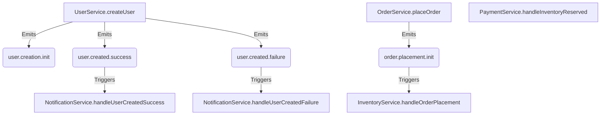

# Adiós al Infierno del Debugging: Coreografiando Sagas en NestJS sin Perder la Cordura

Imagina la escena: es viernes a las 5 PM. Un bug crítico aparece en producción. Una simple acción de "crear usuario" ha fallado en algún punto de una cascada de cinco servicios asíncronos. No hay un _stack trace_ claro, solo logs dispersos con IDs que no parecen conectar. Te sumerges en un mar de `console.log`, rezando por encontrar una pista.

¿Suena familiar? Este es el día a día en el desarrollo de sistemas distribuidos sin las herramientas adecuadas.

El patrón de **Saga Coreografiada** nos ofrece una salida, permitiendo que los servicios se comuniquen a través de eventos de forma desacoplada. Pero su implementación manual puede ser verbosa y propensa a errores. ¿Y si te dijera que existe una forma de implementar este patrón en NestJS que no solo es elegante, sino que automatiza las partes más dolorosas?

Presentamos el `SagaEventModule`, un framework interno diseñado para devolverle la sanidad al desarrollo asíncrono.

## La Pesadilla del Desarrollador: Una Historia de Dolor

Antes de ver la solución, reconozcamos el dolor. Si has trabajado con microservicios, probablemente has sufrido esto:

> **El Debugging Interminable:** "Ok, el controlador recibió la petición. Ahora, hago _step-over_... y la petición desaparece en un `eventEmitter.emit()`. ¿Quién escucha esto? ¿Dónde está el código? Abro la búsqueda global, encuentro tres listeners. ¿Cuál se ejecutó? ¿Y por qué el `correlationId` en este log es diferente al del servicio anterior?"

> **El Agujero Negro de la Observabilidad:** "El cliente dice que su orden falló, pero en mi servicio todo parece estar bien. El servicio de pagos no tiene logs con el ID de mi orden. El de inventario tampoco. ¿Se perdió el evento? ¿Falló silenciosamente? No tengo un mapa del flujo, solo un puñado de servicios que se susurran secretos en la oscuridad."

> **El Monolito Disfrazado:** "Mis 'microservicios' se llaman entre sí con `HttpService`. Para probar el servicio de `Órdenes`, necesito tener levantados los de `Usuarios`, `Pagos` e `Inventario`. Esto no es un sistema distribuido, es un monolito distribuido, con todos los dolores de cabeza de ambos y ninguna de las ventajas."

## Un Faro de Esperanza: El `SagaEventModule`

Este módulo cambia las reglas del juego al cambiar el enfoque del desarrollador de la **fontanería** a la **lógica de negocio**. Se basa en una premisa simple: automatiza todo lo que se pueda automatizar y haz que el resto sea declarativo.

### Diseccionando la Magia: Un Tour por las Funcionalidades

#### 1. Eventos Declarativos con `@EmitsEvent`

El mayor generador de código repetitivo es el manejo de éxito/fallo y la emisión de eventos.

**El Antes (Manual y Propenso a Errores):**
```typescript
// user.service.ts
async createUser(dto: CreateUserDto, metadata: EventMetadata) {
  try {
    const user = await this.userRepo.create(dto);
    const payload = this.helper.createPayload({ user }, metadata);
    this.eventEmitter.emit('user.created.success', payload);
    return user;
  } catch (error) {
    const payload = this.helper.createPayload({ error }, metadata);
    this.eventEmitter.emit('user.created.failure', payload);
    throw error;
  }
}
```

**El Después (Declarativo y Limpio):**
```typescript
// user.service.ts
@EmitsEvent({
  onSuccess: { name: 'user.created.success' },
  onFailure: { name: 'user.created.failure' },
})
async createUser(dto: CreateUserDto) {
  // Lógica de negocio pura. Sin try/catch, sin emit.
  if (Math.random() < 0.5) {
    throw new Error('Random failure during user creation');
  }
  const user = { id: '12345', ...dto };
  return user; // El decorador empaqueta esto en el evento de éxito.
}
```
El decorador `@EmitsEvent` intercepta la ejecución del método. Si se completa, emite el evento `onSuccess`. Si lanza una excepción, emite `onFailure`. Cero boilerplate, cero olvidos.

#### 2. De la Magia al IntelliSense: Tipos Auto-Generados

El uso de strings para los nombres de eventos (`'user.created.success'`) es frágil. Un simple error de tipeo introduce un bug silencioso. El `SagaEventModule` soluciona esto con un generador de tipos.

Al arrancar la aplicación, el `EventGeneratorService` escanea todos los decoradores `@EmitsEvent` y genera un archivo `generated-events.ts` que contiene un objeto `AppEvents` fuertemente tipado.

**El resultado:**
```typescript
// notification.service.ts
import { AppEvents } from '../types/generated-events'; // <-- Tipos generados

@Injectable()
export class NotificationService {
  // Usamos el objeto tipado, no un string.
  // ¡Autocompletado y seguridad contra errores de tipeo!
  @OnEventDoc(AppEvents.USER_CREATED_SUCCESS.name)
  handleUserCreatedSuccess(...) {
    // ...
  }
}
```

#### 3. Trazabilidad a Prueba de Balas con `@CausationEvent`

La trazabilidad es la clave para entender un sistema distribuido. El módulo la hace automática.

1.  **Contexto Automático:** Usando `AsyncLocalStorage` de Node.js, el módulo crea un contexto único para cada petición entrante, generando un `correlationId` que identificará la saga de principio a fin.
2.  **Propagación Declarativa:** Cuando un servicio escucha un evento, simplemente usamos el decorador `@CausationEvent` para indicarle al módulo cuál es el evento que lo originó.

```typescript
// notification.service.ts
@OnEventDoc(AppEvents.USER_CREATED_SUCCESS.name)
handleUserCreatedSuccess(
  @CausationEvent() payload: EventPayload<User>
) {
  // El módulo ya sabe que la metadata de `payload`
  // es la causa de cualquier evento que este método emita.
  // La trazabilidad se mantiene sin esfuerzo.
  console.log(
    `Enviando email para la saga con correlationId: ${payload.metadata.correlationId}`
  );
}
```
El desarrollador no tiene que pasar manualmente los metadatos. El `correlationId` original y el `causationId` (que encadena los eventos) se propagan automáticamente.

#### 4. Observabilidad y Documentación por Defecto

Esta es la funcionalidad estrella. Dado que los eventos y listeners se declaran con nuestros decoradores, el módulo puede escanear toda la aplicación al arrancar para generar artefactos de documentación y exponer endpoints de observabilidad.

##### Documentación Viva

Cuando se arranca la aplicación, se generan dos archivos Markdown cruciales:

1.  **`EVENT_CATALOG.md`**: Una tabla con cada evento, su descripción, qué método lo emite y quiénes lo escuchan.
2.  **`EVENT_FLOW.md`**: Un grafo en formato **Mermaid.js** que visualiza toda la coreografía de eventos.

Esta no es una documentación que un humano dibuja y se desactualiza. **Es un reflejo directo de la arquitectura de tu código, siempre actualizada.**


*Un extracto del grafo generado automáticamente. De un vistazo, puedes ver el flujo completo.*

##### APIs para Depuración en Tiempo Real

El módulo expone varios endpoints bajo el prefijo `/event-docs`:

-   `GET /event-docs/flow`: Devuelve el código fuente del grafo Mermaid, ideal para renderizar en un frontend de monitoreo.
-   `GET /event-docs/sagas`: Lista todos los "iniciadores de sagas" disponibles en la aplicación. Permite saber qué procesos de negocio se pueden ejecutar.
-   `GET /event-docs/sagas/executed`: Muestra una lista de todas las sagas que se han ejecutado, agrupadas por nombre, con detalles de cada instancia (quién la inició, cuándo, y su `correlationId`).
-   `GET /event-docs/saga/:correlationId`: **La joya de la corona.** ¿Tienes el `correlationId` de una transacción que falló? Pégalo aquí.

> Imagina este flujo de trabajo: Soporte te da un `correlationId` de un ticket. Haces una petición a `GET /event-docs/saga/xxxx-xxxx-xxxx` y obtienes un JSON con la secuencia exacta y ordenada de cada evento que ocurrió en esa transacción, con sus payloads completos. El misterio de "qué pasó" se resuelve en segundos, no en horas de rebuscar en logs.

## Conclusión

El `SagaEventModule` es más que una colección de utilidades; es un framework de opinión que impone buenas prácticas para construir sistemas asíncronos observables, resilientes y mantenibles en NestJS.

Al eliminar el código repetitivo, automatizar la trazabilidad, generar tipos seguros y ofrecer tanto documentación viva como endpoints de depuración, transforma la experiencia del desarrollador. Libera a los equipos para que se centren en lo que realmente importa: diseñar y construir una lógica de negocio robusta, dejando que el framework se encargue de la compleja pero esencial fontanería de los sistemas distribuidos.