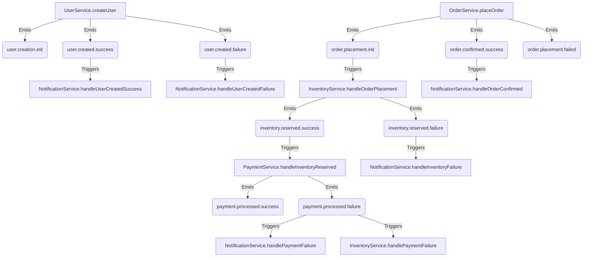

<p align="center">
  <a href="http://nestjs.com/" target="blank"></a>
</p>

<h1 align="center">SagaEventModule: Un Framework para Sagas Coreografiadas en NestJS</h1>

<p align="center">
  <strong>Estado:</strong> Prueba de Concepto 🧪
</p>

## Resumen

Este repositorio es una prueba de concepto para un **módulo NestJS reutilizable (`SagaEventModule`)** diseñado para estandarizar y simplificar la implementación de sistemas asíncronos basados en eventos y el patrón **Saga (Coreografía)**.

El objetivo principal es **eliminar el código repetitivo (boilerplate)** y los errores comunes asociados a la gestión de eventos, la propagación de metadatos de trazabilidad y la lógica de `try/catch`. La solución se centra en un sistema de **decoradores "mágicos" pero declarativos** que automatizan estas tareas, permitiendo a los desarrolladores centrarse exclusivamente en la lógica de negocio.

## El Problema: La Complejidad de los Sistemas Asíncronos

Construir sistemas robustos y mantenibles basados en eventos es complejo. Los desarrolladores a menudo enfrentan los siguientes desafíos:

- **Código Repetitivo:** Escribir bloques `try/catch` para manejar éxitos y fallos en cada método que inicia una operación asíncrona.
- **Emisión Manual de Eventos:** Acordarse de emitir los eventos correctos (`operation.success`, `operation.failure`) en cada rama del código.
- **Pérdida de Trazabilidad:** Propagar manualmente IDs de correlación y causalidad a través de múltiples servicios y eventos es tedioso y propenso a errores.
- **Documentación Desactualizada:** Mantener diagramas y catálogos de eventos sincronizados con un código que evoluciona constantemente es una tarea casi imposible.

## La Solución: Un Framework Declarativo y Automatizado

El `SagaEventModule` aborda estos problemas proveyendo un conjunto de herramientas que automatizan las tareas repetitivas y garantizan la consistencia.

### Principios de Diseño

- **Experiencia de Desarrollador (DX) Superior:** Una API intuitiva y explícita que se siente nativa del ecosistema NestJS.
- **Magia Controlada:** El módulo oculta la complejidad, pero lo hace de una manera predecible y declarativa.
- **Trazabilidad por Defecto:** Cada acción es rastreable de extremo a extremo a través de un `correlationId` y un `causationId`.
- **Arquitectura Viva:** La documentación y los tipos se generan automáticamente a partir del código fuente, asegurando que siempre estén actualizados.

## Componentes Clave

- **`@EmitsEvent(options)`**: El decorador principal. Envuelve un método y, de forma automática, emite eventos de éxito o fallo basándose en el resultado de la ejecución (si retorna un valor o lanza una excepción).
- **`@OnEventDoc(eventName)`**: Un reemplazo para el `@OnEvent` de NestJS que, además de suscribir un método a un evento, registra la relación para la generación de documentación.
- **`@CausationEvent()`**: Un decorador de parámetro que marca cuál es el evento entrante que causó la ejecución del método actual, permitiendo al sistema propagar la cadena de trazabilidad.
- **`EventLogService`**: Un servicio que escucha todos los eventos (`*`) y los persiste en un log (`event-log.json`), proporcionando una auditoría completa sin esfuerzo adicional.
- **Generadores Automáticos**:
  - `EventGeneratorService`: Genera los tipos de todos los eventos de la aplicación en `src/saga-event-module/types/generated-events.ts`.
  - `EventDocumentationService`: Genera un catálogo de eventos y un grafo de flujo visual en formato Mermaid.

## Cómo Funciona: Un Vistazo Rápido

#### 1. Emitir un Evento (El Inicio de la Saga)

El desarrollador solo necesita decorar el método. No hay `try/catch`, no hay `eventEmitter.emit`.

```typescript
// src/user/user.service.ts
@Injectable()
export class UserService {
  // ...
  @EmitsEvent({
    onInit: { name: 'user.creation.init' },
    onSuccess: { name: 'user.created.success' },
    onFailure: { name: 'user.created.failure' },
  })
  createUser(createUserDto: CreateUserDto) {
    this.logger.log('Attempting to create user:', createUserDto);

    if (Math.random() < 0.5) {
      throw new Error('Random failure during user creation');
    }

    const user = { id: '12345', ...createUserDto };
    return user; // Este valor será el payload del evento de éxito.
  }
}
```

#### 2. Escuchar un Evento (La Continuación de la Saga)

Otro servicio reacciona al evento emitido. El decorador `@CausationEvent` permite obtener la metadata del evento anterior para mantener la trazabilidad.

```typescript
// src/notifications/notification.service.ts
@Injectable()
export class NotificationService {
  // ...
  @OnEventDoc('user.created.success')
  handleUserCreatedSuccess(
    @CausationEvent()
    payload: EventPayload<{ id: string; name: string; email: string }>,
  ) {
    this.logger.log(`Sending welcome email to ${payload.data.name}`);
    this.logger.log('Correlation ID:', payload.metadata.correlationId);
  }
}
```

## Artefactos Auto-Generados

Al iniciar la aplicación, el módulo genera automáticamente:

1.  **Catálogo de Eventos (`docs/generated/EVENT_CATALOG.md`)**: Un archivo Markdown que documenta cada evento, quién lo emite y quién lo escucha.
2.  **Grafo de Flujo de Eventos (`docs/generated/EVENT_FLOW.md`)**: Un diagrama en formato Mermaid que visualiza la coreografía completa de la saga.
3.  **Endpoint de Visualización**: El diagrama de flujo también está disponible en `http://localhost:3000/event-docs/flow` para ser consumido por un frontend.

### Ejemplo de Grafo de Flujo

El siguiente diagrama es generado automáticamente y muestra las relaciones entre los servicios `UserService` y `NotificationService`:



## Instalación y Uso

```bash
# 1. Instalar dependencias
$ yarn install

# 2. Iniciar en modo de desarrollo
$ yarn start:dev
```

Al iniciar, los servicios de generación se ejecutarán y crearán los tipos y la documentación en los directorios `src/saga-event-module/types` y `docs/generated`.

## Licencia

Este proyecto está licenciado bajo la Licencia MIT.
